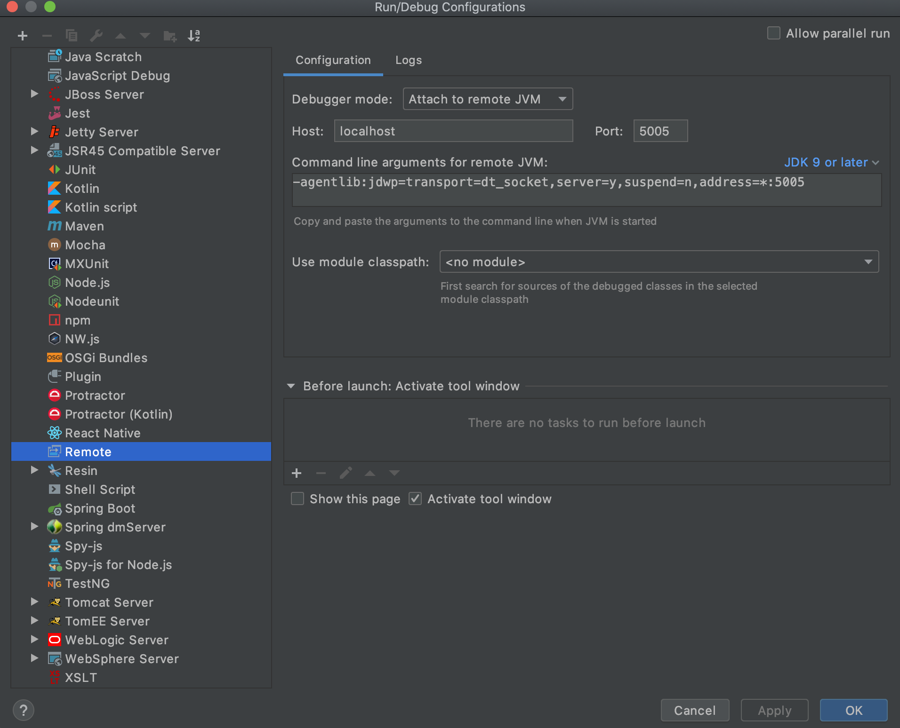

# Spring Boot REST microservice

Java / Maven / Spring Boot microservice

* Full integration with the latest **Spring** Framework 1.x: inversion of control, dependency injection, etc.
* Packaging as a single jar with embedded container (tomcat 8)
* Demonstrates how to set up healthcheck, metrics, info, environment, etc. endpoints automatically on a configured port. Inject your own health / metrics info with a few lines of code.
* RESTful service using annotation: supports both XML and JSON request / response
* Exception mapping from application exceptions to the right HTTP response with exception details in the body
* *Spring Data* Integration with JPA/Hibernate
* CRUD functionality with H2 in-memory data source using Spring *Repository* pattern
* MockMVC test framework
* Self-documented APIs: Swagger2 using annotations

## Pre-requisites

TODO: for each app/tool add link to the installation page

- macos x
- sdkman
- JDK
- maven 3.x
- curl
- http
- minikube
- docker

## Build and Run

This application is packaged as a jar which has Tomcat 8 embedded.

* Clone this repository
```
git clone git@github.com:AndriyKalashnykov/spring-boot-rest-example.git
cd spring-boot-rest-example
```
* Select JDK
```
sdk use java 8.0.232.hs-adpt
```
or
```
sdk use java 11.0.5.hs-adpt
```
* Build the project and run the tests by running
```
mvn clean package
```
* Run the service
```
  java -jar -Dspring.profiles.active=default target/spring-boot-rest-example-0.0.1.jar
```        
or
```
  mvn spring-boot:run -Drun.arguments="spring.profiles.active=default"
```


### Application health, configurations, documentation links

```
http://localhost:8081/env
http://localhost:8081/health
http://localhost:8081/info
http://localhost:8081/metrics
http://localhost:8081/configprops

http://localhost:8080/swagger-ui.html
```

### Microservice API

```
curl -X POST 'http://localhost:8080/example/v1/hotels' --header 'Content-Type: application/json' --header 'Accept: application/json' --data @hotel.json --stderr -
```
or
```
http POST 'http://localhost:8080/example/v1/hotels' < hotel.json
```
or
```
curl -X POST 'http://localhost:8080/example/v1/hotels' --header 'Content-Type: application/json' --header 'Accept: application/json' -d '{"name":"Beds R Us","description":"Very basic, small rooms but clean","city":"Santa Ana","rating":2}' --stderr -
```

### Retrieve a paginated list of hotels

```
curl -X GET --silent 'http://localhost:8080/example/v1/hotels?page=0&size=10' --stderr -  2>&1 | jq .
```
or
```
http  'http://localhost:8080/example/v1/hotels?page=0&size=10'
```
### Swagger 2 API docs

```
open -a /Applications/Google\ Chrome.app http://localhost:8080/swagger-ui.html
```


### Building docker image


#### Optional, local test only: Using local maven cache

  In order to build image quickly by compiling maven project using host OS  maven repo

  Build project, artifact will be placed in $PWD/target

  ```
  cd spring-boot-rest-example
  docker run -v ~/.m2:/root/.m2 -v "$PWD":/usr/src -w /usr/src maven:3-jdk-8 mvn clean package
  ```

  #### Build non multi-stage image using existing artifact in $PWD/target

  ```
  cd spring-boot-rest-example
  docker rm -f spring-boot-rest-example
  docker build  -f Dockerfile.maven-host-cache -t spring-boot-rest-example .
  ```

  #### Build  multi-stage image  

  ```
  docker rm -f spring-boot-rest-example
  docker build  -f Dockerfile.maven-multi-stage-layer-cached -t spring-boot-rest-example .
  ```


  #### Test application

  ```
  # adding 100 to port number to avoid local conflicts (McAfee runs on 8081)
  docker run --name spring-boot-rest-example -p 8080:8080 -p 8181:8081 spring-boot-rest-example:latest

  curl -X POST 'http://localhost:8080/example/v1/hotels' --header 'Content-Type: application/json' --header 'Accept: application/json' --data @hotel.json --stderr -

  curl -X GET --silent 'http://localhost:8080/example/v1/hotels?page=0&size=10' --stderr -  2>&1 | jq .

  ```

### Attaching to the application from IDE

Run the service with these command line options:

```
mvn spring-boot:run -Drun.jvmArguments="-Xdebug -Xrunjdwp:transport=dt_socket,server=y,suspend=y,address=5005"
```
or

```
java -agentlib:jdwp=transport=dt_socket,server=y,suspend=n,address=5005 -Dspring.profiles.active=test -Ddebug -jar target/spring-boot-rest-example-0.0.1.jar
```

IntelliJ : Run -> Edit configuration -> Remote.



### Deploy application to k8s

```
minikube delete --all
minikube start -p minikube --memory=16384 --cpus=6 --disk-size=30g --vm-driver=virtualbox
eval $(minikube docker-env)
eval "$(docker-machine env -u)"
# minikube start --vm-driver=virtualbox --extra-config=apiserver.anonymous-auth=false --insecure-registry=localhost:5000

mvn clean package -DskipTests -Pk8s fabric8:undeploy
mvn clean package -Pk8s fabric8:deploy

minikube ssh 'docker logs $(docker ps -a -f name=k8s_kube-api --format={{.ID}})'
```

### Deploy application to k8s overriding runtime JDK/JRE
```
mvn clean package fabric8:deploy -Dfabric8.generator.from=fabric8/java-alpine-openjdk8-jdk
```

### Test deployed application

```
curl -X POST --header 'Content-Type: application/json' --header 'Accept: application/json' --data @hotel.json $(minikube service spring-boot-rest-example --url | sed -n 1p)/example/v1/hotels
http $(minikube service spring-boot-rest-example --url | sed -n 1p)/example/v1/hotels?page=0&size=10

http $(minikube service spring-boot-rest-example --url | sed -n 2p)/swagger-ui.html
http $(minikube service spring-boot-rest-example --url | sed -n 2p)/info
http $(minikube service spring-boot-rest-example --url | sed -n 2p)/health
```

### Monitor k8s resources
```
kubectl get nodes --no-headers | awk '{print $1}' | xargs -I {} sh -c 'echo {}; kubectl describe node {} | grep Allocated -A 5 | grep -ve Event -ve Allocated -ve percent -ve -- ; echo'
kubectl top pod --all-namespaces
```
